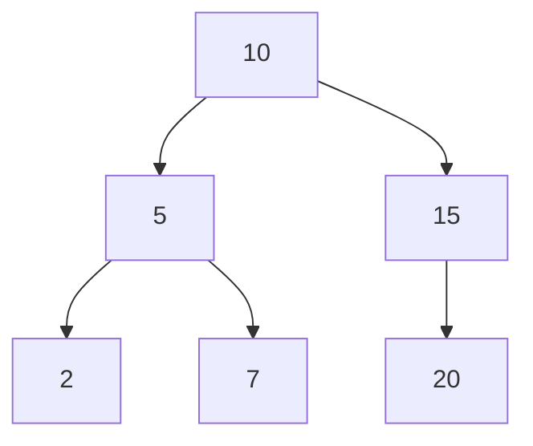
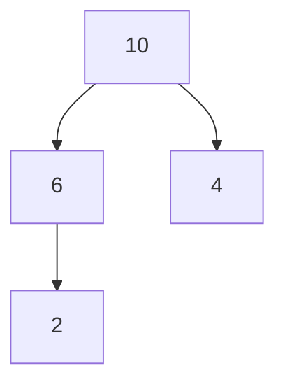
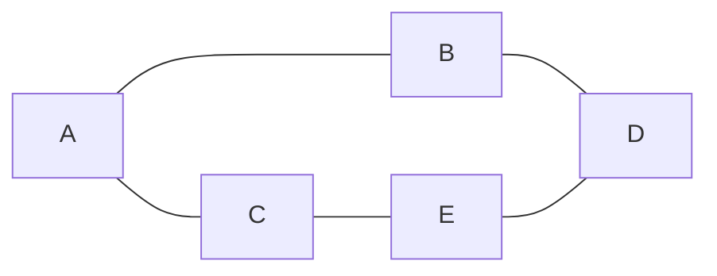
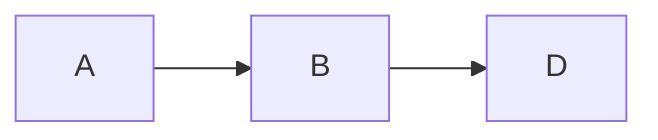

# Java Data Structures and Algorithms Portfolio

## Table of Contents

- [Project Structure](#project-structure)
- [Core Data Structures](#01-core-data-structures)
- [Algorithms](#02-algorithms)
- [Mini Projects](#03-mini-projects)
- [Data Structure Visualizations](#data-structure-visualizations)
- [Complexity Analysis](#complexity-analysis)
- [How to Run](#how-to-run)
- [Topics Covered](#topics-covered)
- [Purpose](#purpose)

This repository contains implementations of fundamental **data structures**, **algorithms**, and **mini projects** written in Java.

The goal of this project is to demonstrate understanding of core computer science concepts such as:

- data structures
- algorithm design
- time complexity analysis
- graph traversal
- search systems

This repository is structured as a learning portfolio and a reference for classical DSA concepts.

---

# Project Structure

java-dsa-portfolio/

01-core-data-structures/

02-algorithms/

03-mini-projects/

analysis/

README.md

---

# 01 Core Data Structures

This section contains implementations of fundamental data structures.

## Stack
LIFO (Last-In-First-Out) data structure.

Operations:
- push
- pop
- peek
- size

Time complexity:

| Operation | Complexity |
|---|---|
| push | O(1) |
| pop | O(1) |

---

## Queue
FIFO (First-In-First-Out) data structure.

Operations:
- enqueue
- dequeue
- peek

Time complexity:

| Operation | Complexity |
|---|---|
| enqueue | O(1) |
| dequeue | O(1) |

---

## Linked List
Custom implementation of a singly linked list.

Operations:
- addFirst
- addLast
- remove
- search

Time complexity:

| Operation | Complexity |
|---|---|
| addFirst | O(1) |
| addLast | O(n) |

---

## HashMap
Custom hash table implementation with collision handling.

Operations:

| Operation | Complexity |
|---|---|
| put | O(1) average |
| get | O(1) average |
| remove | O(1) average |

Worst case complexity:

O(n)

---

## Binary Search Tree

Binary tree structure maintaining sorted order.

Operations:

| Operation | Average | Worst |
|---|---|---|
| insert | O(log n) | O(n) |
| search | O(log n) | O(n) |
| delete | O(log n) | O(n) |

---

# 02 Algorithms

## Sorting Algorithms

Implemented sorting methods:

- Bubble Sort
- Merge Sort
- Quick Sort

Complexity comparison:

| Algorithm | Best | Average | Worst |
|---|---|---|---|
| Bubble Sort | O(n) | O(n²) | O(n²) |
| Merge Sort | O(n log n) | O(n log n) | O(n log n) |
| Quick Sort | O(n log n) | O(n log n) | O(n²) |

---

## Searching Algorithms

- Linear Search
- Binary Search

| Algorithm | Complexity |
|---|---|
| Linear Search | O(n) |
| Binary Search | O(log n) |

---

## Recursion

Examples of recursive algorithms:

- Factorial
- Fibonacci

These examples illustrate base cases and recursive decomposition.

---

## Graph Algorithms

Graph traversal algorithms implemented using adjacency lists.

Algorithms included:

- Breadth First Search (BFS)
- Depth First Search (DFS)

Complexity:

O(V + E)

Where:
- V = number of vertices
- E = number of edges

---

# 03 Mini Projects

Mini projects demonstrating real-world usage of data structures and algorithms.

## Task Scheduler

A priority-based task scheduling system using a **Max Heap priority queue**.

Features:
- add tasks
- execute highest priority task
- view next task

Time complexity:

| Operation | Complexity |
|---|---|
| addTask | O(log n) |
| executeTask | O(log n) |

---

## Text Search Engine

Simple search engine using an **inverted index**.

Concepts used:
- HashMap
- tokenization
- indexing

Search complexity:

O(1) average

---

## Route Planner

A simple route planning system using graph traversal.

Uses:
- Graph representation
- BFS shortest path search

Example output:

Route = [A, B, D]

---

# Data Structure Visualizations

## Binary Search Tree Example

## Max Heap (Task Scheduler Priority Queue)

## Graph Representation

### BFS Route Example

---

# Complexity Analysis

Detailed complexity analysis is available in:

analysis/complexity.md

---

# How to Run

Compile:

javac -d out src/main/java/**/*.java

Run example:

java -cp out dsa.algorithms.sorting.MergeSort

---

# Topics Covered

This repository demonstrates knowledge of:

- stacks
- queues
- linked lists
- hash tables
- binary search trees
- sorting algorithms
- search algorithms
- recursion
- graph traversal
- priority queues
- inverted indexes

---

# Purpose

This project serves as a **data structures and algorithms learning portfolio** and reference implementation in Java.

